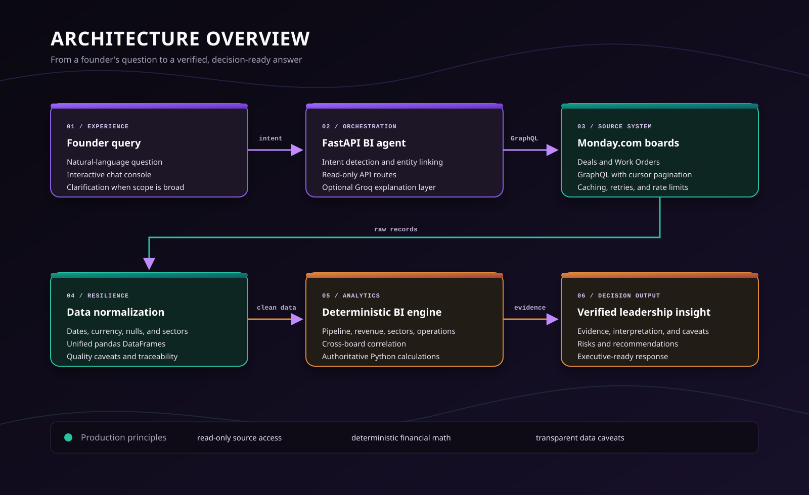
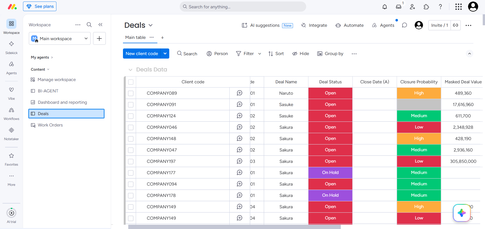
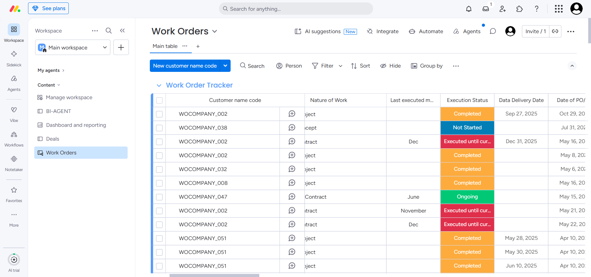
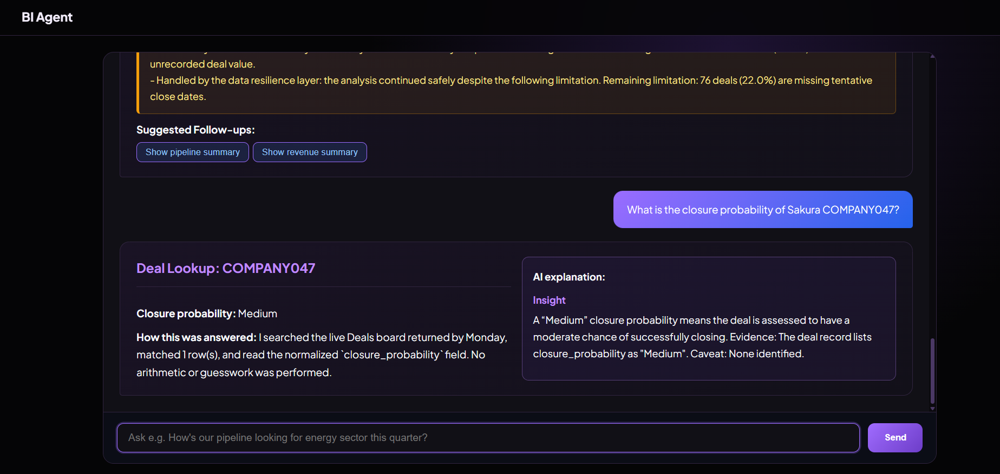
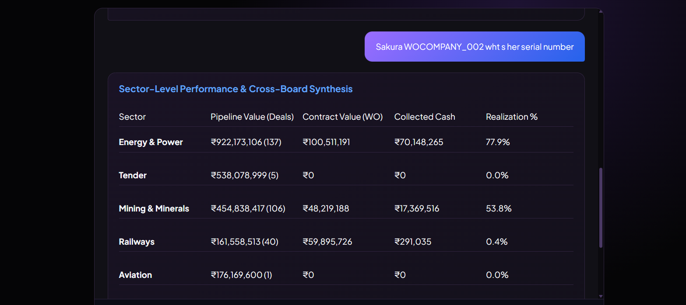

Skylark Drones - Monday.com Business Intelligence Agent

 **An intelligent, resilient, founder-level BI Agent that dynamically queries Monday.com Deals & Work Orders boards, cleans messy real-world data, resolves ambiguity, and generates strategic executive insights.**

---

##  System Architecture



```
┌────────────────────────────────────────────────────────┐
│                        User                            │
└──────────────────────────┬─────────────────────────────┘
                           │ Natural Language Query
                           ▼
┌────────────────────────────────────────────────────────┐
│                   BI Agent (LLM)                       │
│    - Query Understanding & Intent Classification       │
│    - Ambiguity Detection & Clarifying Questions        │
│    - Tool Calling & Contextual Synthesis               │
└──────────────────────────┬─────────────────────────────┘
                           │ Structured Query / Intent
                           ▼
┌────────────────────────────────────────────────────────┐
│         MCP Server / Monday Data Tools Layer           │
│    - Dynamic GraphQL queries with pagination           │
│    - Token & Authentication management                 │
│    - Board caching & rate-limit resilience             │
└──────────────────────────┬─────────────────────────────┘
                           │ GraphQL Query (Read-Only)
                           ▼
┌────────────────────────────────────────────────────────┐
│                   Monday.com API                       │
│    - Deals Board (Sales Pipeline Data)                 │
│    - Work Orders Board (Project Execution Data)        │
└──────────────────────────┬─────────────────────────────┘
                           │ Raw JSON Records
                           ▼
┌────────────────────────────────────────────────────────┐
│               Data Resilience Layer                    │
│    - Null & Missing Value Handling                     │
│    - Multi-format Date Normalization                   │
│    - Sector & Status Naming Harmonization              │
│    - Schema Validation & Data Quality Caveats          │
└──────────────────────────┬─────────────────────────────┘
                           │ Cleaned & Unified DataFrames
                           ▼
┌────────────────────────────────────────────────────────┐
│                    BI Engine                           │
│    - Revenue Realization & Collections (Excl/Incl GST) │
│    - Pipeline Health (Stages, Value, Probabilities)    │
│    - Sector Analysis (Energy, Mining, Infra, etc.)     │
│    - Operational Metrics (WO Status, Delays, AR)       │
│    - Cross-Board Correlation (Deal <-> Work Order)     │
│    - Temporal & Quarterly Trend Analysis               │
└──────────────────────────┬─────────────────────────────┘
                           │ Computed Metrics & Evidence
                           ▼
┌────────────────────────────────────────────────────────┐
│      Insight Generator + Leadership Update Engine      │
│    - Contextual Strategic Synthesis                    │
│    - High-Impact Executive Summaries                   │
│    - Risk Matrix & Actionable Recommendations          │
└──────────────────────────┬─────────────────────────────┘
                           │
                           ▼
┌────────────────────────────────────────────────────────┐
│              Final Verified Answer / Output            │
└──────────────────────────┬─────────────────────────────┘
```

---

## Product Screenshots

### 1. Deals Board



### 2. Work Orders Board



### 3. BI Agent Query Response



### 4. Sector-Level Performance



---

## Requirements to Implementation Mapping

| Requirement (Company Specification) | Implementation in Skylark BI Agent |
| :--- | :--- |
| **Monday.com Integration** | Dynamic GraphQL API queries with cursor-based pagination, token authentication via `.env`, read-only operations. |
| **Query Understanding** | Intelligent query classifier supporting natural language business questions, keyword extraction, temporal scoping (quarterly, fiscal year), and entity linking. |
| **Clarifying Questions** | Dynamic detection of ambiguous or underspecified queries (e.g., unspecified sector, undefined timeframe, or missing metric scope) prompting targeted clarifying questions. |
| **Sector Performance** | Unified cross-board sector aggregation (Energy/Power, Mining, Railways, Infra, Telecom, Agriculture, etc.) with deal volume, realization rates, and market share. |
| **Cross-Board Queries** | Seamless joining of Deals and Work Orders across common identifiers (Deal Name, Serial #, Company Name, Sector) to correlate sales pipeline with execution reality. |
| **Context & Insights** | High-level synthesis connecting raw data points to business implications (e.g., bottleneck warnings, conversion drop-offs, AR concentration risks). |
| **Leadership Updates** | Dedicated executive-ready briefing workflow generating structured executive KPI dashboards, operational risks, revenue outlook, and strategic next steps. |


Financial calculations are performed by Python/Pandas and supplied to the optional Groq explanation layer as authoritative evidence. The LLM may explain the result, but it must not calculate, replace, or invent values.

## Tech Stack Justification

- **Python 3.13:** Provides a mature ecosystem for data processing, API development, testing, and environment-based configuration.
- **FastAPI + Uvicorn:** Delivers a lightweight REST API with automatic OpenAPI documentation at `/docs` and a production-ready ASGI server.
- **Pandas:** Supports resilient normalization and deterministic calculations across Deals and Work Orders data without moving financial arithmetic into the LLM.
- **Monday.com GraphQL API:** Keeps the application connected to live board data through read-only queries, cursor pagination, retries, and in-memory TTL caching.
- **Optional Groq LLM:** Adds executive-level explanation and synthesis while Python remains the source of truth for verified metrics.
- **Vanilla HTML5/CSS3/JavaScript:** Keeps the interactive dashboard responsive and easy to deploy, with no frontend build pipeline or separate client application.
- **Render:** Hosts the FastAPI service as a web process using the assigned `PORT`, environment-managed secrets, and the `/api/health` health check.


---

## Monday Board Setup

### 1. Import and Prepare the Monday Boards

Import the XLSX files into Monday.com as two separate boards: **Deals** and **Work Orders**. After importing, review every column individually and update it to the correct Monday column type before connecting the API. In particular, configure dates as Date columns, amounts as Numbers, statuses as Status, and identifiers as Text or Numbers according to the source data.

### 2. Create a Monday API Token

In Monday.com, open your profile menu, choose **Developers**, and create a personal API token with read access to the Deals and Work Orders boards. Keep the token private and never commit it to Git.

### 3. Find the Board IDs

Open each board in Monday.com and copy its numeric board ID from the URL. Configure the Deals board as `MONDAY_DEALS_BOARD_ID` and the Work Orders board as `MONDAY_WORK_ORDERS_BOARD_ID`.

### 4. Configure Environment Variables

For local development, create a `.env` file
